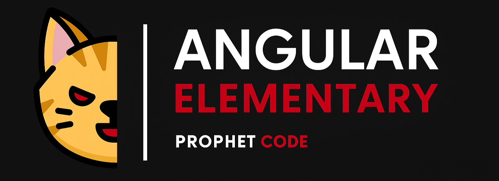

# Curso gratuito de Angular desde cero

Este repositorio acompaña mi curso gratuito en YouTube donde aprenderás Angular desde cero, pero con una visión completa: desde sus conceptos legacy hasta las capacidades más modernas que ofrece Angular 20.

🚀 **Este es el único proyecto del curso** y en él iré integrando cada nuevo tema, incluyendo comparaciones entre prácticas antiguas (`NgModules`, `ReactiveForms`, etc.) y las nuevas APIs como `provideHttpClient`, `inject()`, routing standalone, entre otras.

📺 **Playlist del curso en YouTube**  
👉 [Haz clic aquí para ver la playlist completa](https://youtube.com/playlist?list=PLD4CDC34D7sMfVxx037MsX3_IbZ_0mFwA&si=lfr5iMmI-Q83hRYp)

## 🔍 ¿Qué encontrarás en este repositorio?

- ✅ Proyecto completo con Angular 20
- 🧱 Componentes sin `NgModules` (arquitectura moderna)
- 🔁 Comparaciones con código legacy cuando es útil para el aprendizaje
- 🧭 Routing moderno usando `provideRouter` y lazy loading sin módulos
- 🧪 Pruebas unitarias adaptadas a la nueva arquitectura
- 💡 Explicaciones progresivas en cada carpeta

> ⚠️ Este repositorio **no contiene código legacy directo**, sino que se comparan conceptos y se contrastan patrones antiguos vs. modernos dentro del mismo proyecto.

## 📚 Público objetivo

- Personas que están empezando con Angular desde cero
- Desarrolladores que vienen de versiones antiguas
- Programadores que desean dominar Angular 20 con buenas prácticas actuales

## 📦 Requisitos

- Node.js 22 o superior
- Angular CLI 20 (`npm install -g @angular/cli`)
- Ganas de aprender 💪

## ▶️ ¿Cómo iniciar el proyecto?

```bash
npm install
npm run dev
```

## 🤝 Contribuciones

Si deseas aportar mejoras, sugerencias o ideas para ampliar el curso, eres bienvenido. Puedes crear un Pull Request o abrir un issue.

✨ Este curso está en desarrollo activo, así que no olvides suscribirte al canal para seguir recibiendo actualizaciones.
